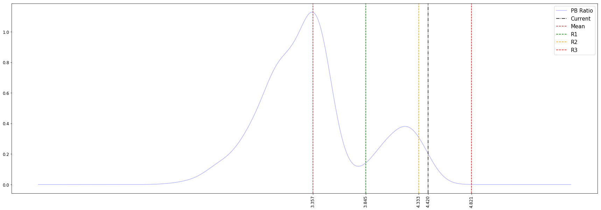
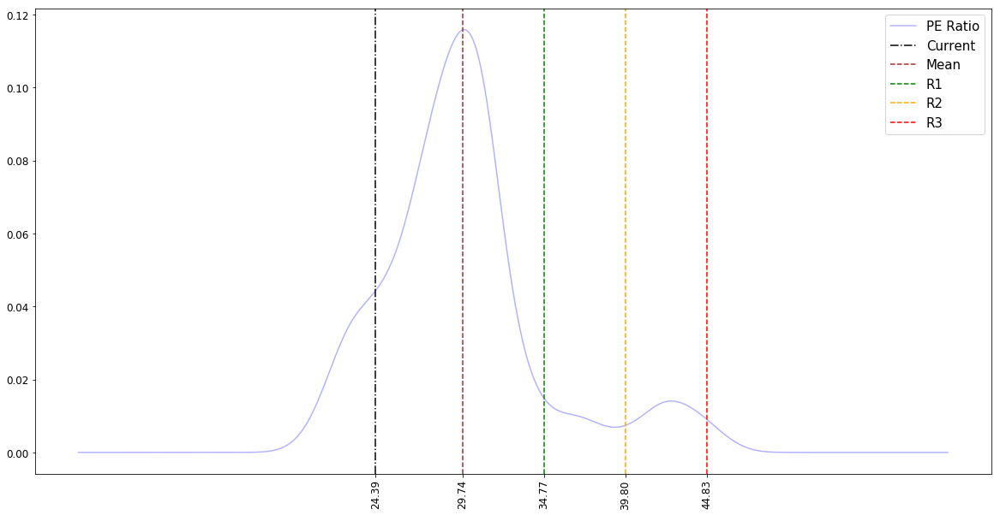
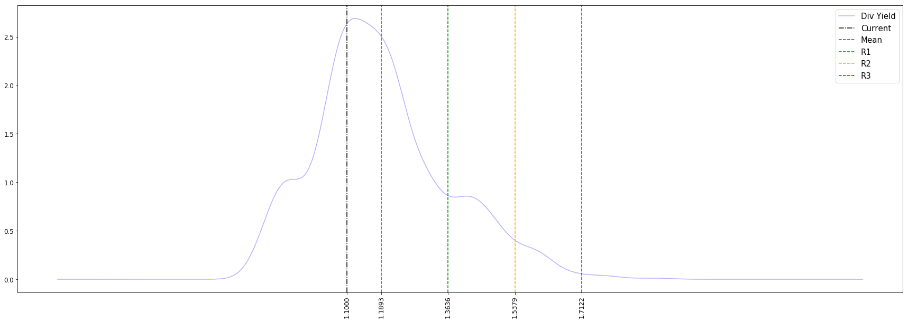

# Mister Market

It is a project to develop an end-to-end system that can assess the current valuation level of the NIFTY500 benchmark index via statistical analysis of historical data to assist investors in making informed decisions.

The valuation level can be determined by analysis of three indicators:

* PE Ratio: It measures the current price of a stock relative to its trailing earning.

* PB Ratio: It measures the current price of a stock in comparison to its trailing book value.

* Dividend Yield Ratio: This ratio measures the current price of a stock in comparison to the dividend it has rendered.

Since a benchmark index is a weighted average of a collection of stocks, the above three ratios for it is measured accordingly. Arguably, the PB ratio is often the most stable indicator of market valuation among the three.

**Note: Run the codes in the Normal Distribution folder**

## Output

### [09-April-2022] PB Ratio Distribution Code Output

 

> Wait while we download data from NSE server  
>
> Confidence intervals of NIFTY 500 PB Ratio
>
> The confidence between L2-L3 =  1.03 %  
> The confidence between L(1.5)-L2 =  3.35 %  
> The confidence between L1-L(1.5) =  9.01 %  
> The confidence between L(0.5)-L1 =  18.42 %  
> The confidence between Mean-L(0.5) =  24.21 %  
>
> The confidence between Mean-R(0.5) =  22.79 %  
> The confidence between R(0.5)-R1 =  1.67 %  
> The confidence between R1-R(1.5) =  6.25 %  
> The confidence between R(1.5)-R2 =  9.98 %  
> The confidence between R2-R3 =  3.22 %  
>
> The current market PB resides in the R2-R3 zone  
>
>   
>

### [09-April-2022] PE Ratio Distribution Code Output

 

> Wait while we download data from NSE server  
>
> Confidence intervals of NIFTY 500 PE Ratio
>
> The confidence between L2-L3 =  0.06 %  
> The confidence between L(1.5)-L2 =  3.67 %  
> The confidence between L1-L(1.5) =  9.53 %  
> The confidence between L(0.5)-L1 =  15.26 %  
> The confidence between Mean-L(0.5) =  27.56 %  
>
> The confidence between Mean-R(0.5) =  25.95 %  
> The confidence between R(0.5)-R1 =  6.25 %  
> The confidence between R1-R(1.5) =  2.77 %  
> The confidence between R(1.5)-R2 =  1.61 %  
> The confidence between R2-R3 =  6.37 %  
>
>   
>

### [09-April-2022] Dividend Yield Distribution Code Output

 

> Wait while we download data from NSE server  
>
> Confidence intervals of NIFTY 500 Div Yield 
>
> The confidence between L2-L3 =  0.00 %  
> The confidence between L(1.5)-L2 =  4.38 %  
> The confidence between L1-L(1.5) =  9.27 %  
> The confidence between L(0.5)-L1 =  20.41 %  
> The confidence between Mean-L(0.5) =  20.48 %  
>
> The confidence between Mean-R(0.5) =  19.45 %  
> The confidence between R(0.5)-R1 =  9.01 %  
> The confidence between R1-R(1.5) =  8.11 %  
> The confidence between R(1.5)-R2 =  4.64 %  
> The confidence between R2-R3 =  3.73 %  
>
>   
>

## Tech Stack

* Python 3.7
* Spyder 3.3.3 (Included in Anaconda Distribution)

## Future Improvements

* Include a statement stating current position of PE and Dividend Yield over their respective historic distributions

## License

The contents are licensed under the [MIT License](https://opensource.org/licenses/MIT)